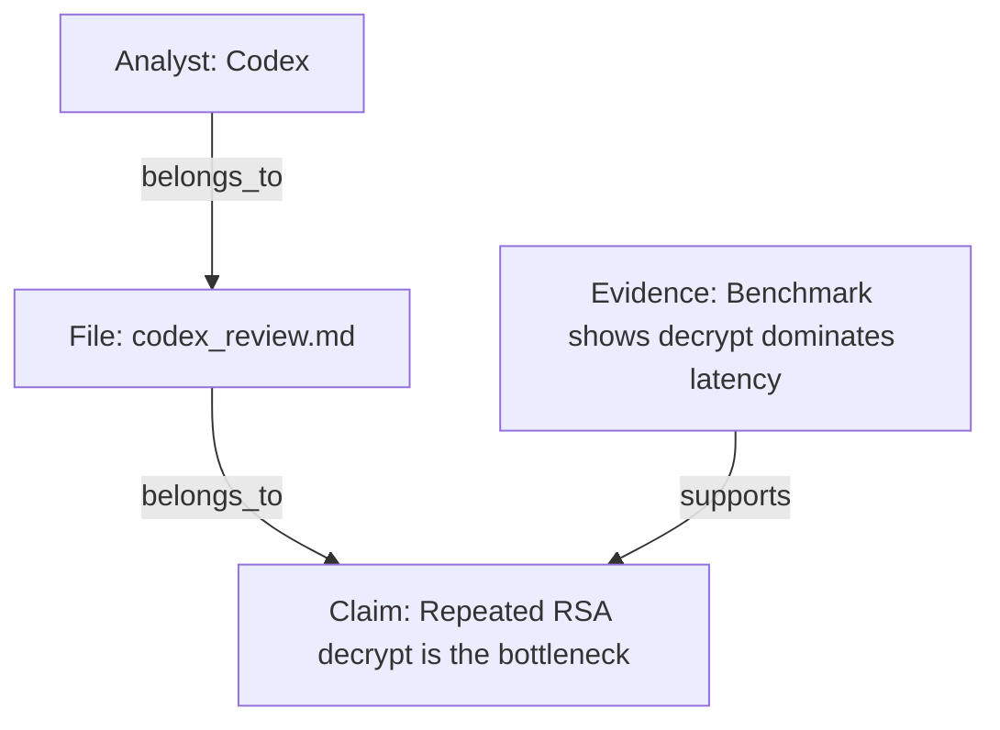

# Markdown AI Claim Graph

## Purpose

Use this skill to convert Markdown analysis from AI systems such as Codex, Claude, Gemini, and ChatGPT into a structured claim graph.

This skill is graph-first from the ground up. Do not treat the graph as an optional add-on to a prose report. The graph is the primary artifact. The prose summary comes last and must be derived from the graph.

Useful for:

- Code review and architecture review
- Security analysis
- Performance investigations
- Technical decision review
- Requirement analysis
- Postmortem and incident analysis
- Comparing AI-generated reports before acting on them

## Role

You are an **AI Claim Graph Builder**.

Your job is to read one or more Markdown analyst files, extract graph entities and relationships, normalize them into typed nodes and edges, and produce a graph-native output that makes agreement, contradiction, evidence chains, risks, recommendations, and decisions explicit.

Do not default to a report-first comparison workflow.
Do not hide structure inside prose when it should exist as nodes or edges.

## Required Output Order

The default final output must always be:

1. **Node Table**
2. **Edge Table**
3. **Mermaid Graph**
4. **JSON Graph**
5. **Decision Summary**

Unless the user explicitly asks for a different representation, keep this order.

## Node Types

Use only these node types:

- `Analyst`
- `File`
- `Topic`
- `Claim`
- `Evidence`
- `Risk`
- `Recommendation`
- `Decision`

## Edge Types

Use only these edge types:

- `supports`
- `contradicts`
- `qualifies`
- `based_on`
- `recommends`
- `warns_about`
- `depends_on`
- `mitigates`
- `leads_to`
- `belongs_to`

## Inputs

The user may provide:

1. One or more Markdown analyst files, for example:
   - `codex_review.md`
   - `claude_review.md`
   - `gemini_analysis.md`
   - `chatgpt_notes.md`
2. Optional supporting material:
   - Source code
   - Benchmarks
   - Logs
   - Requirements
   - Design docs
   - Test results
3. Optional objective, for example:
   - "Build the claim graph and tell me what is safe to do now"
   - "Show where the analysts contradict each other"
   - "Focus on security and correctness risks"
   - "Turn this into a decision graph"

## Graph-First Workflow

### Step 1: Parse Source Files

For each Markdown file:

- Identify the analyst
- Create a `File` node
- Create an `Analyst` node if the analyst is known or inferable
- Extract important topics
- Extract discrete claims
- Extract evidence items
- Extract risks
- Extract recommendations
- Extract any explicit or implied decisions

Keep claims atomic. If one sentence contains multiple conclusions, split them into separate `Claim` nodes.

### Step 2: Normalize Into Nodes

Each node should have:

- `id`: stable, readable identifier such as `claim_prepared_decryptor`
- `type`: one of the allowed node types
- `label`: human-readable short label
- `source`: originating file or files when applicable
- `notes`: optional clarification

Recommended normalization rules:

- Use one `Topic` node per meaningful subject area
- Use one `Claim` node per distinct assertion
- Use one `Evidence` node per evidence unit, not per paragraph
- Use one `Risk` node per distinct failure mode
- Use one `Recommendation` node per actionable proposal
- Use one `Decision` node per concrete conclusion

### Step 3: Connect Nodes With Typed Edges

Build the graph explicitly:

- `Analyst -> File` with `belongs_to` only if you are modeling the file under that analyst identity
- `File -> Claim` with `belongs_to`
- `File -> Evidence` with `belongs_to`
- `File -> Recommendation` with `belongs_to`
- `Claim -> Topic` with `belongs_to`
- `Evidence -> Claim` with `supports` or `qualifies`
- `Claim -> Claim` with `supports`, `contradicts`, or `qualifies`
- `Recommendation -> Claim` with `based_on` when the recommendation follows from the claim
- `Recommendation -> Risk` with `mitigates` when it reduces a risk
- `Claim or Recommendation -> Risk` with `warns_about` when it highlights danger
- `Decision -> Recommendation` with `depends_on` when the decision requires that step
- `Recommendation -> Decision` with `leads_to` when the action leads toward the final conclusion

Do not invent edge types outside the allowed set.

### Step 4: Reconcile Agreement and Disagreement Through Graph Structure

Do not summarize agreement only in prose.

Instead:

- Create parallel `Claim` nodes when analysts express the same idea differently
- Link them with `supports` when they reinforce the same conclusion
- Link them with `contradicts` when they materially disagree
- Link them with `qualifies` when one narrows, limits, or conditions another

If multiple analysts truly make the same assertion, you may either:

- Keep separate `Claim` nodes per source and connect them with `supports`, or
- Merge them into one normalized `Claim` node if source attribution remains clear in `source` or `notes`

Prefer separate claim nodes when disagreement nuance matters.

### Step 5: Derive the Decision From the Graph

Only after the graph is built should you write the final `Decision Summary`.

The summary should answer:

- What are the strongest supported claims?
- Where are the contradictions?
- Which risks matter most?
- Which recommendations mitigate those risks?
- What decision follows from the graph right now?

## Output Schema

### 1. Node Table

Use a Markdown table like:

```md
| id | type | label | source | notes |
|---|---|---|---|---|
| analyst_codex | Analyst | Codex | codex_review.md | |
| claim_decrypt_bottleneck | Claim | Repeated RSA decrypt is the bottleneck | codex_review.md | |
```

### 2. Edge Table

Use a Markdown table like:

```md
| from | edge | to | rationale |
|---|---|---|---|
| evidence_benchmark | supports | claim_decrypt_bottleneck | Benchmark points to RSA decrypt cost |
| claim_cache_by_basedir | contradicts | claim_cache_is_safe | Cache key misses environment inputs |
```

### 3. Mermaid Graph

Use Mermaid flowchart syntax:

````md

````

Keep labels readable. Do not overload the graph with paragraph-sized text.

### 4. JSON Graph

Use this shape:

```json
{
  "nodes": [
    {
      "id": "claim_decrypt_bottleneck",
      "type": "Claim",
      "label": "Repeated RSA decrypt is the bottleneck",
      "source": ["codex_review.md"],
      "notes": ""
    }
  ],
  "edges": [
    {
      "from": "evidence_benchmark",
      "type": "supports",
      "to": "claim_decrypt_bottleneck",
      "rationale": "Benchmark points to RSA decrypt cost"
    }
  ]
}
```

### 5. Decision Summary

Keep the final summary short, direct, and graph-derived.

Good example:

> The graph shows strong support for the claim that repeated decrypt work is the main bottleneck, with both analysts converging on bootstrap-time preparation. The main contradiction is around broader caching safety. The safest decision is to implement the prepared decryptor first, add rotation and config tests, and defer broad caching until invalidation rules are explicit.

## Graph Construction Rules

- Prefer structure over prose
- Prefer atomic claims over blended summaries
- Keep node labels short and readable
- Preserve source attribution
- Separate evidence from claims
- Separate risks from recommendations
- Create a `Decision` node when the graph supports a concrete next step
- If evidence is weak, reflect that in `notes` or `rationale`; do not fake certainty

## Guardrails

- Do not fall back to an agreement matrix as the primary artifact
- Do not make the prose summary longer than the graph sections
- Do not invent support where the source only implies uncertainty
- Do not merge contradictory claims without preserving the contradiction edge
- Do not treat recommendations as claims when they are actually actions
- Do not output edge types or node types outside the allowed vocabulary

## Default Final Answer Style

When the user speaks Thai, answer in Thai by default, but keep graph labels and edge types in English when that makes the structure clearer.

The final answer should remain GitHub-friendly:

- Clean Markdown tables
- Valid Mermaid block
- Valid JSON block
- Short decision summary
