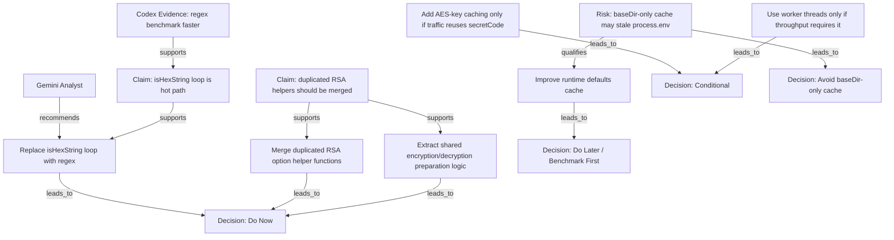

# Markdown AI Claim Graph Output

## Node Table

| ID | Type | Source | Text | Confidence |
|---|---|---|---|---|
| A1 | Analyst | `codex_analyst.md` | Codex Analyst | High |
| A2 | Analyst | `gemini_analyst.md` | Gemini Analyst | High |
| C1 | Claim | Gemini | `isHexString()` loop is a hot path | Medium |
| C2 | Claim | Codex | Duplicated RSA helpers should be merged | High |
| E1 | Evidence | Codex | Benchmark shows regex is faster than manual loop | High |
| R1 | Risk | Codex | Runtime defaults cached by `baseDir` only may stale `process.env` | High |
| REC1 | Recommendation | Shared | Replace `isHexString()` loop with regex | High |
| REC2 | Recommendation | Codex | Improve runtime defaults cache | Medium |
| REC3 | Recommendation | Shared | Merge duplicated RSA option helper functions | High |
| REC4 | Recommendation | Shared | Extract shared encryption/decryption preparation logic | High |
| REC5 | Recommendation | Gemini | Add AES-key caching only if real traffic reuses the same `secretCode` | Medium |
| REC6 | Recommendation | Gemini | Use worker threads only if throughput or event-loop blocking becomes a production issue | Low |
| D1 | Decision | System | Do Now | High |
| D2 | Decision | System | Do Later / Benchmark First | High |
| D3 | Decision | System | Conditional | Medium |
| D4 | Decision | System | Avoid | High |

## Edge Table

| From | Relation | To |
|---|---|---|
| A2 | recommends | REC1 |
| E1 | supports | C1 |
| C1 | supports | REC1 |
| C2 | supports | REC3 |
| C2 | supports | REC4 |
| R1 | qualifies | REC2 |
| REC1 | leads_to | D1 |
| REC3 | leads_to | D1 |
| REC4 | leads_to | D1 |
| REC2 | leads_to | D2 |
| REC5 | leads_to | D3 |
| REC6 | leads_to | D3 |
| R1 | leads_to | D4 |

## Mermaid Graph



## JSON Graph

```json
{
  "nodes": [
    {
      "id": "A1",
      "type": "Analyst",
      "source": "codex_analyst.md",
      "text": "Codex Analyst",
      "confidence": "high"
    },
    {
      "id": "A2",
      "type": "Analyst",
      "source": "gemini_analyst.md",
      "text": "Gemini Analyst",
      "confidence": "high"
    },
    {
      "id": "C1",
      "type": "Claim",
      "source": "gemini_analyst.md",
      "text": "`isHexString()` loop is a hot path",
      "confidence": "medium"
    },
    {
      "id": "E1",
      "type": "Evidence",
      "source": "codex_analyst.md",
      "text": "Benchmark shows regex is faster than manual loop",
      "confidence": "high"
    },
    {
      "id": "R1",
      "type": "Risk",
      "source": "codex_analyst.md",
      "text": "Runtime defaults cached by `baseDir` only may stale `process.env`",
      "confidence": "high"
    },
    {
      "id": "REC1",
      "type": "Recommendation",
      "source": "shared",
      "text": "Replace `isHexString()` loop with regex",
      "priority": "do_now"
    }
  ],
  "edges": [
    {
      "from": "E1",
      "relation": "supports",
      "to": "C1"
    },
    {
      "from": "C1",
      "relation": "supports",
      "to": "REC1"
    },
    {
      "from": "REC1",
      "relation": "leads_to",
      "to": "D1"
    }
  ]
}
```

## Decision Summary

### Do Now

- Replace `isHexString()` manual loop with regex
- Merge duplicated RSA option helper functions
- Extract shared encryption/decryption preparation logic

### Do Later

- Improve runtime defaults cache only after confirming the current path is still hot
- Optimize key path resolution only if profiler shows measurable impact

### Conditional

- Add AES-key caching only if real traffic reuses the same `secretCode`
- Use worker threads only if throughput or event-loop blocking becomes a production issue

### Avoid

- Do not cache runtime defaults by `baseDir` only
- Do not weaken RSA settings purely for speed without an explicit security decision
