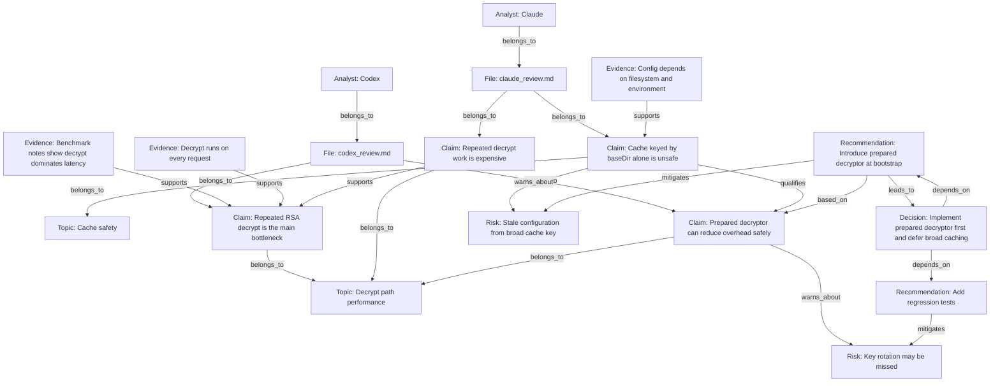

# Markdown AI Claim Graph Output

## Node Table

| id | type | label | source | notes |
|---|---|---|---|---|
| analyst_codex | Analyst | Codex | codex_review.md | |
| analyst_claude | Analyst | Claude | claude_review.md | |
| file_codex | File | codex_review.md | codex_review.md | |
| file_claude | File | claude_review.md | claude_review.md | |
| topic_decrypt_path | Topic | Decrypt path performance | codex_review.md, claude_review.md | |
| topic_cache_safety | Topic | Cache safety | codex_review.md, claude_review.md | |
| claim_codex_bottleneck | Claim | Repeated RSA decrypt is the main bottleneck | codex_review.md | |
| claim_claude_repeated_work | Claim | Repeated decrypt work is expensive | claude_review.md | |
| claim_claude_cache_risk | Claim | Cache keyed by baseDir alone is unsafe | claude_review.md | |
| claim_codex_prepared_api | Claim | A prepared decryptor can reduce overhead safely | codex_review.md | |
| evidence_codex_benchmark | Evidence | Benchmark notes show decrypt dominates latency | codex_review.md | |
| evidence_codex_hot_path | Evidence | Hot path calls decrypt on every request | codex_review.md | |
| evidence_claude_env_inputs | Evidence | Config depends on filesystem and runtime environment | claude_review.md | |
| risk_stale_config | Risk | Stale configuration from broad cache key | codex_review.md, claude_review.md | |
| risk_key_rotation | Risk | Key rotation may be missed by unsafe caching | codex_review.md | |
| rec_prepared_decryptor | Recommendation | Introduce prepared decryptor at bootstrap | codex_review.md, claude_review.md | |
| rec_add_regression_tests | Recommendation | Add regression tests for config changes and key rotation | claude_review.md | |
| decision_safe_next_step | Decision | Implement prepared decryptor first and defer broad caching | codex_review.md, claude_review.md | |

## Edge Table

| from | edge | to | rationale |
|---|---|---|---|
| analyst_codex | belongs_to | file_codex | Codex authored the file |
| analyst_claude | belongs_to | file_claude | Claude authored the file |
| file_codex | belongs_to | claim_codex_bottleneck | Claim extracted from Codex file |
| file_claude | belongs_to | claim_claude_repeated_work | Claim extracted from Claude file |
| file_claude | belongs_to | claim_claude_cache_risk | Claim extracted from Claude file |
| file_codex | belongs_to | claim_codex_prepared_api | Claim extracted from Codex file |
| claim_codex_bottleneck | belongs_to | topic_decrypt_path | Claim is about decrypt path performance |
| claim_claude_repeated_work | belongs_to | topic_decrypt_path | Claim is about decrypt path performance |
| claim_claude_cache_risk | belongs_to | topic_cache_safety | Claim is about cache safety |
| claim_codex_prepared_api | belongs_to | topic_decrypt_path | Claim is about decrypt path optimization |
| evidence_codex_benchmark | supports | claim_codex_bottleneck | Benchmark notes point to decrypt cost |
| evidence_codex_hot_path | supports | claim_codex_bottleneck | Decrypt is executed on every request |
| evidence_claude_env_inputs | supports | claim_claude_cache_risk | Cache key misses environment-sensitive inputs |
| claim_claude_repeated_work | supports | claim_codex_bottleneck | Both claims converge on repeated decrypt cost |
| claim_claude_cache_risk | qualifies | claim_codex_prepared_api | Claude narrows how optimization should be done safely |
| claim_claude_cache_risk | warns_about | risk_stale_config | Unsafe cache key can create stale config |
| claim_codex_prepared_api | warns_about | risk_key_rotation | Optimization must not weaken rotation behavior |
| rec_prepared_decryptor | based_on | claim_codex_prepared_api | Recommendation follows from prepared API claim |
| rec_prepared_decryptor | mitigates | risk_stale_config | Safer than broad caching |
| rec_add_regression_tests | mitigates | risk_key_rotation | Tests reduce rotation and config regression risk |
| decision_safe_next_step | depends_on | rec_prepared_decryptor | Decision requires bootstrap-time preparation |
| decision_safe_next_step | depends_on | rec_add_regression_tests | Decision requires safety tests |
| rec_prepared_decryptor | leads_to | decision_safe_next_step | Action leads toward the chosen decision |

## Mermaid Graph



## JSON Graph

```json
{
  "nodes": [
    {
      "id": "analyst_codex",
      "type": "Analyst",
      "label": "Codex",
      "source": ["codex_review.md"],
      "notes": ""
    },
    {
      "id": "analyst_claude",
      "type": "Analyst",
      "label": "Claude",
      "source": ["claude_review.md"],
      "notes": ""
    },
    {
      "id": "claim_codex_bottleneck",
      "type": "Claim",
      "label": "Repeated RSA decrypt is the main bottleneck",
      "source": ["codex_review.md"],
      "notes": ""
    },
    {
      "id": "claim_claude_cache_risk",
      "type": "Claim",
      "label": "Cache keyed by baseDir alone is unsafe",
      "source": ["claude_review.md"],
      "notes": ""
    },
    {
      "id": "risk_stale_config",
      "type": "Risk",
      "label": "Stale configuration from broad cache key",
      "source": ["codex_review.md", "claude_review.md"],
      "notes": ""
    },
    {
      "id": "rec_prepared_decryptor",
      "type": "Recommendation",
      "label": "Introduce prepared decryptor at bootstrap",
      "source": ["codex_review.md", "claude_review.md"],
      "notes": ""
    },
    {
      "id": "decision_safe_next_step",
      "type": "Decision",
      "label": "Implement prepared decryptor first and defer broad caching",
      "source": ["codex_review.md", "claude_review.md"],
      "notes": ""
    }
  ],
  "edges": [
    {
      "from": "evidence_codex_benchmark",
      "type": "supports",
      "to": "claim_codex_bottleneck",
      "rationale": "Benchmark notes point to decrypt cost"
    },
    {
      "from": "claim_claude_cache_risk",
      "type": "warns_about",
      "to": "risk_stale_config",
      "rationale": "Broad cache key misses environment-sensitive inputs"
    },
    {
      "from": "rec_prepared_decryptor",
      "type": "mitigates",
      "to": "risk_stale_config",
      "rationale": "Prepared decryptor is safer than broad caching"
    },
    {
      "from": "decision_safe_next_step",
      "type": "depends_on",
      "to": "rec_prepared_decryptor",
      "rationale": "The decision requires bootstrap-time preparation"
    }
  ]
}
```

## Decision Summary

The graph shows strong support for the claim that repeated decrypt work is the main bottleneck, and both analysts converge on bootstrap-time preparation as the safest near-term action. The most important qualification is that broader caching carries stale-config and key-rotation risk. The safest decision is to implement the prepared decryptor first, add regression tests, and defer broad caching until invalidation rules are explicit.
